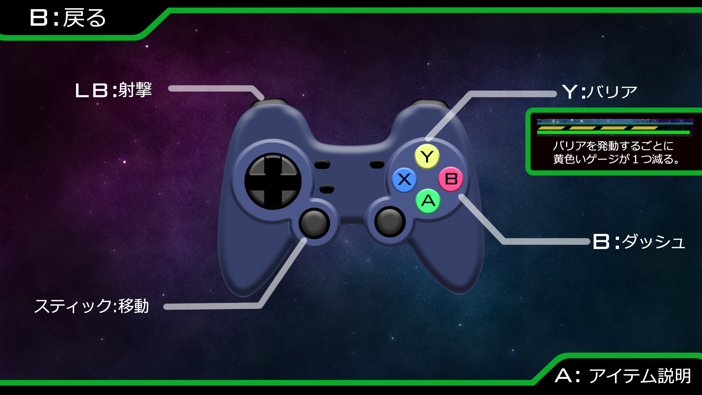

# UNIVESE PILOT

河原電子ビジネス専門学校  
ゲームクリエイター科1年　国宇雄飛

# 目次
- 作品概要  
- 操作説明  
- こだわったところ

# １.作品概要
- UNIVRSE PILOT

1-1、1-2、1-3の3つのステージが存在し、それぞれのステージのボスを倒してスコアを獲得し、より高いランクを目指すシューティングゲームです。

- 制作人数  
1人  
- 制作期間  
2022年5月~2022年12月  
- ゲームジャンル  
シューティングゲーム  
- プレイ人数  
　1人  
- 使用言語  
　C++  
- 開発環境  
  + エンジン  
k2Engine(学校内製のエンジン)  
  + 使用したツール  
Visual Studio 2022  
3ds MAX  
Adobe Photoshop2023  
Effekseer  
  + 音源  
Audiostock

# ２.担当ソースコード
- BackGround.h、BackGround.cpp  
1-3のボスステージの背景の処理。  
- Bariaｈ、Baria.cpp  
バリア、スーパーバリアの処理。
- Boss01.h、Boss01.cpp  
1-1のボスの処理。  
- Boss02.h、Boss02.cpp  
1-2のボスの処理。  
- Boss03.h、Boss03.cpp  
1-3のボスの処理。  
- Box1_1.h、Box1_1.cpp  
ステージ選択画面の1-1のオブジェクトの処理。  
- Box1_2.h、Box1_2.cpp  
ステージ選択画面の1-2のオブジェクトの処理。  
- Box1_3.h、Box1_3.cpp  
ステージ選択画面の1-3のオブジェクトの処理。  
- Coin.h、Coin.cpp  
コインの処理。
- Dangan.h、Dangan.cpp  
プレイヤーの打つ弾の処理。  
- Enemy_bomb.h、Enemy_bomb.cpp  
1-3のボスが生成するボムの処理。  
- Enemy01.h、Enemy01.cpp  
一つ目のエネミーの処理。  
- Enemy02.h、Enemy02.cpp  
殻のついたエネミーの処理。  
- Explanation.h、Explanation.cpp  
操作説明画面、アイテム説明画面の処理。  
- Game.h、Game.cpp  
ステージ1-1の処理。
- Game_final.h、Game_final.cpp  
ステージ1-3のボスステージの処理。  
- Game2.h、Game2.cpp  
ステージ1-2の処理。  
- Game3.h、Game3.cpp  
ステージ1-3のボスステージ以外の処理。  
- GameCamera.h、GameCamera.cpp  
1-1、1-2、1-3のカメラの処理。  
- GameCamera_sc.h、GameCamera_sc.cpp  
ステージ選択画面のカメラの処理。  
- Gameover.h、Gameover.cpp  
ゲームオーバー画面の処理。  
- Gamestart.h、Gamestart.cpp  
タイトル画面の処理。  
- GameUI.h、GameUI.cpp  
1-1のUIの処理。  
- GameUI2.h、GameUI2.cpp
1-2のUIの処理。  
- GameUI3.h、GameUI3.cpp  
1-3のUIの処理。  
- Kyuen.h、Kyuen.cpp  
アイテムカプセルの処理。  
- Masingan.h、Masingan.cpp  
マシンガンの処理。  
- Numberhouse.h、Numberhouse.cpp  
挑戦しているステージのナンバーを取得するクラス。  
- Player.h、Player.cpp  
プレイヤーの処理。  
- Repair.h、Repair.cpp  
リペアキットの処理。  
- Result.h、Result.cpp  
リザルト画面の処理。  
- Sc_bg.h、Sc_bg.cpp  
ステージ選択画面の背景の処理。  
- SceneChangeDoor.h、SceneChangeDoor.cpp  
ステージを選択したしたときや、ステージ1-3のボスステージへの切り替　　わりの際に画像を生成する処理。  
- Scoreboard.h、Scoreboard.cpp  
ステージ選択画面のステージのランクを示したオブジェクトの処理。  
- Tama.h、Tama.cpp  
エネミーが打つ弾の処理。  
- Tama_big.h、Tama_big.cpp  
ステージ1-2のボスの打つ大きな弾の処理。  
- Tama_tuibi.h、Tama_tuibi.cpp
エネミーが打つプレイヤーを追尾する弾の処理。  
- Walls.h、Walls.cpp  
ボスステージ以外のステージの背景の処理。 

# ３．	操作説明　

# ４.こだわったところ
- 4.1　ステージ選択画面のランク表示  
ステージ選択画面で、挑戦したステージのランクを表示するために、画面が切り替わるたびにそれぞれのステージのランクを示す値を次に生成する画面のクラスの値に代入しています。  
▼ステージ選択画面  

- 4.2　プレイヤーを追尾するビーム  
１-３のボスがビームエフェクトを再生し始めたら、ボスの座標からプレイヤーまでのベクトルを計算します。次に、(0.0f,0.0f,0.0f)に設定したビームエフェクト用のベクトルNewdiffのX軸を4.0ずつ、Y軸を2.5ずつ、計算したベクトルより小さい間増やして正規化したものをmoveSpeedとします。そして、moveSpeedのX軸とZ軸をatan2関数でY軸の角度に変換してangleに代入し、angleを元にY軸回りの回転クォータニオンを作成しました。X軸も同様の処理を行い、ビームを回転させプレイヤーに徐々に近づくようにしました。 
 
 
このステージでは、ボスがビームを打った時に1度きりのスーパーバリアを使用してビームを無効化できます。
ですが、ある程度ステージクリアが難しくなるようにしたかったため、ビームエフェクト用のベクトルNewdiffが計算したベクトルより大きくなったら、常に計算したベクトルを代入して、プレイヤーにビームが当たり続けるようにしました。

- 4.3　1-3のボスステージ  
ステージの１-３のボスは、視点を変えてエネミーが正面に見えるようにして迫力を出しクライマックス感を演出しました。ボスの見た目をコアのような見た目にして他のエネミー達を束ねるボスのようにしました。  
▼1-3のボスステージ以外のステージ  

- 4.4　世界観  
ステージを選択した後に画面上下の扉が閉まって、開いた時にステージの画面が出るようにして、出撃しているように感じるようにしました。  
▼ステージ選択画面からステージ画面に移った画面
